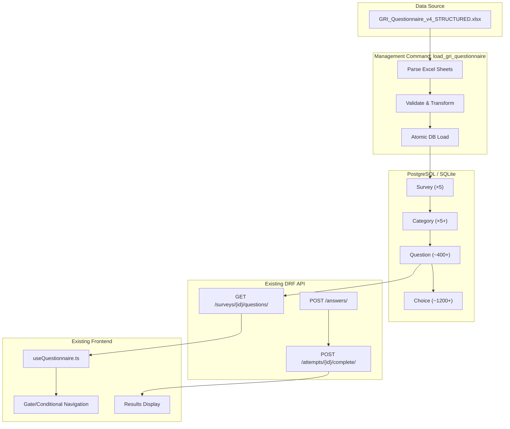
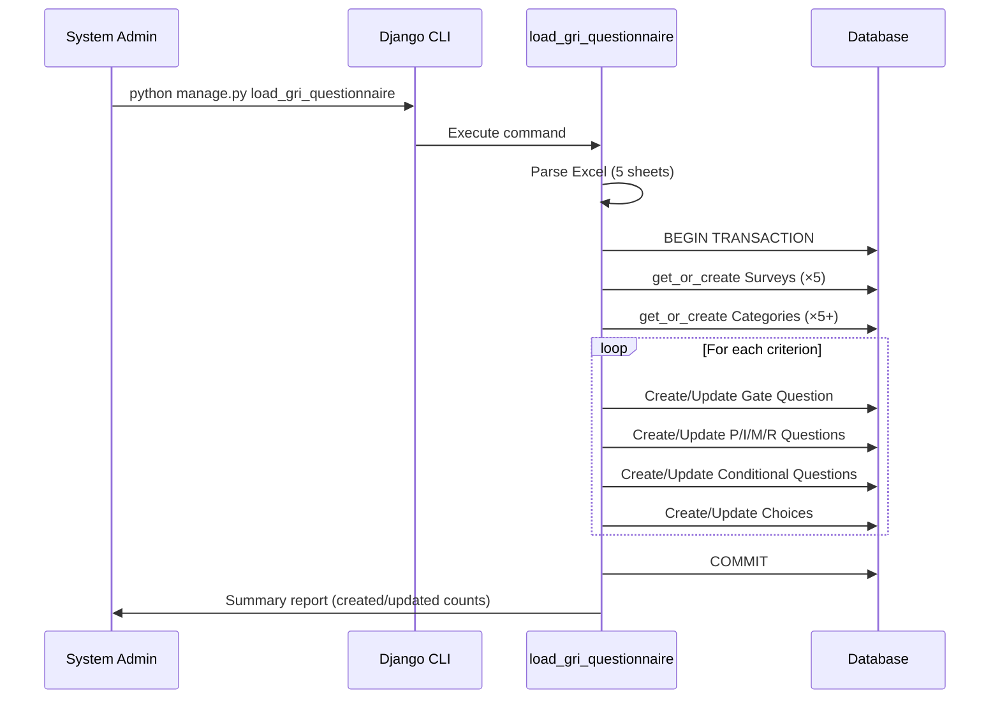

# Design Document: GRI Questionnaire Flow

## Overview

This feature implements a complete data seeding pipeline and validates the end-to-end scoring correctness for the GRI (Global Reporting Initiative) sustainability questionnaire system. The system already has the Django models, DRF API endpoints, and frontend navigation logic in place. This design focuses on:

1. **Seeder management command** (`load_gri_questionnaire`): Creates 5 surveys, categories, and loads ~400+ questions with full gate/conditional/layer/numerical metadata from the structured Excel source.
2. **Scoring validation**: Ensures the existing `get_category_breakdown()` correctly handles gate-skip, numerical thresholds, multi-select, and cross-criterion linkage scenarios.
3. **Sector integration**: Validates that the sector filtering API returns correct question subsets and sector scores are properly aggregated.

The design leverages existing infrastructure — no new models or API endpoints are required. The seeder populates data that flows through the existing `Question → Choice → Answer → get_category_breakdown()` pipeline, which the frontend already consumes via `useQuestionnaire.ts`.

## Architecture



### Data Flow



## Components and Interfaces

### 1. Management Command: `load_gri_questionnaire`

**Location:** `sustindex-/questionnaire/management/commands/load_gri_questionnaire.py`

```python
class Command(BaseCommand):
    help = "Load complete GRI questionnaire data from structured Excel file"

    def add_arguments(self, parser):
        parser.add_argument('--file', default='data/GRI_Questionnaire_v4_STRUCTURED.xlsx')
        parser.add_argument('--dry-run', action='store_true')
        parser.add_argument('--force', action='store_true', help='Delete existing data before loading')

    def handle(self, *args, **options):
        # Entry point — wraps everything in atomic transaction
        pass
```

**Responsibilities:**
- Parse the structured Excel file (one sheet per GRI section + sector sheet)
- Create/update Survey and Category records
- Create/update Question records with full metadata (layer, criterion_code, is_gate, conditional links, numerical_thresholds)
- Create/update Choice records with correct scores
- Assign sequential order values respecting the GATE→P→I→COND→M→R sequence
- Handle cross-criterion linkage (G10→G11)
- Output summary report
- Roll back on any error

### 2. Excel Parser Module

**Location:** `sustindex-/questionnaire/management/commands/_gri_parser.py`

```python
@dataclass
class ParsedQuestion:
    criterion_code: str
    layer: str          # GATE | P | I | M | R | CONDITIONAL
    text_tr: str
    text_en: str
    question_type: str  # single | multi | binary | numerical
    is_gate: bool
    choices: list[ParsedChoice]
    numerical_thresholds: list[dict] | None
    conditional_on_code: str | None  # criterion_code of parent
    conditional_on_layer: str | None  # layer of parent question
    conditional_on_min_score: int
    bonus_points: int
    sector: str         # '' for universal, sector code for sector-specific

@dataclass
class ParsedChoice:
    text_tr: str
    text_en: str
    score: int
    order: int

def parse_gri_excel(filepath: str) -> dict[str, list[ParsedQuestion]]:
    """Parse Excel file into structured data per survey section."""
    pass
```

### 3. Survey Configuration Constants

```python
SURVEY_CONFIG = {
    'GRI1': {
        'name': 'GRI 1 — Governance & Strategy',
        'name_tr': 'GRI 1 — Yönetişim ve Strateji',
        'name_en': 'GRI 1 — Governance & Strategy',
        'max_score': 320,
        'order': 1,
        'criteria_range': ('G1', 'G16'),
    },
    'GRI2': {
        'name': 'GRI 2 — Environmental Performance',
        'name_tr': 'GRI 2 — Çevresel Performans',
        'name_en': 'GRI 2 — Environmental Performance',
        'max_score': 280,
        'order': 2,
        'criteria_range': ('E1', 'E14'),
    },
    'GRI3': {
        'name': 'GRI 3 — Social Performance',
        'name_tr': 'GRI 3 — Sosyal Performans',
        'name_en': 'GRI 3 — Social Performance',
        'max_score': 480,
        'order': 3,
        'criteria_range': ('S1', 'S24'),
    },
    'GRI4': {
        'name': 'GRI 4 — Economic & Reporting',
        'name_tr': 'GRI 4 — Ekonomik ve Raporlama',
        'name_en': 'GRI 4 — Economic & Reporting',
        'max_score': 180,
        'order': 4,
        'criteria_range': ('EC1', 'EC9'),
    },
    'SECTOR': {
        'name': 'Sector Standards',
        'name_tr': 'Sektör Standartları',
        'name_en': 'Sector Standards',
        'max_score': 123,  # Varies by sector; this is the max across sectors
        'order': 5,
        'sectors': ['agri', 'energy', 'finance', 'construction',
                    'manufacturing', 'health', 'tech', 'retail'],
    },
}

GATE_CRITERIA = {
    'GRI1': ['G1', 'G3', 'G7', 'G10'],
    'GRI2': ['E2', 'E3', 'E5', 'E9', 'E10', 'E12', 'E14'],
    'GRI3': ['S7', 'S8', 'S15', 'S17', 'S18', 'S19', 'S20', 'S21', 'S22', 'S23', 'S24'],
    'GRI4': ['EC6', 'EC7'],
}

CROSS_CRITERION_LINKS = {
    'G11': {'gate_criterion': 'G10', 'min_score': 1},
}

SECTOR_MAX_SCORES = {
    'agri': 123,
    'energy': 121,
    'finance': 121,
    'manufacturing': 114,
    'construction': 115,
    'health': 119,
    'tech': 117,
    'retail': 123,
}

LAYER_MAX_POINTS = {
    'P': 4,
    'I': 6,
    'M': 6,
    'R': 4,
}
```

### 4. Idempotent Loader

```python
class GRILoader:
    """Handles idempotent creation/update of all questionnaire entities."""

    def __init__(self, dry_run: bool = False):
        self.dry_run = dry_run
        self.stats = {'surveys': {'created': 0, 'updated': 0},
                      'categories': {'created': 0, 'updated': 0},
                      'questions': {'created': 0, 'updated': 0},
                      'choices': {'created': 0, 'updated': 0}}

    def load_survey(self, key: str, config: dict) -> Survey:
        """get_or_create Survey, update fields if changed."""
        pass

    def load_category(self, survey: Survey, config: dict) -> Category:
        """get_or_create Category for survey, update fields if changed."""
        pass

    def load_question(self, survey: Survey, category: Category,
                      parsed: ParsedQuestion, order: int) -> Question:
        """Create or update Question by (survey, criterion_code, layer) unique key."""
        pass

    def load_choices(self, question: Question, parsed_choices: list[ParsedChoice]):
        """Sync choices: delete removed, create new, update existing by order."""
        pass

    def link_conditionals(self, survey: Survey, questions: dict):
        """Second pass: resolve conditional_on_question FKs after all questions exist."""
        pass

    def link_cross_criteria(self, questions: dict):
        """Third pass: link G11 questions to G10 gate."""
        pass
```

### 5. Integration Points (No Changes Required)

The seeder's output integrates with existing systems without modification:

| Component | How It Connects |
|-----------|----------------|
| `get_category_breakdown()` | Reads questions by `survey` + `is_active`, groups by `category_id`, applies gate-skip via `criterion_code` + `is_gate` |
| `useQuestionnaire.ts` | `isQuestionVisible()` checks `conditional_on_question`, `conditional_on_min_score`, `is_gate`, `criterion_code` |
| Sector API filter | `GET /surveys/{id}/questions/?attempt=X` filters by `Q(sector='') | Q(sector=selected_sector)` |
| Results page | Reads `get_category_breakdown()` response which already returns per-category scores |

## Data Models

No new models are introduced. The seeder populates existing models with the following data patterns:

### Survey Records (×5)

| Survey | Categories | Total Questions | Max Score |
|--------|-----------|-----------------|-----------|
| GRI 1 — Governance & Strategy | 1 | ~80 | 320 |
| GRI 2 — Environmental Performance | 1 | ~70 | 280 |
| GRI 3 — Social Performance | 1 | ~120 | 480 |
| GRI 4 — Economic & Reporting | 1 | ~45 | 180 |
| Sector Standards | 8 (one per sector) | 96 | Varies |

### Question Metadata Patterns

```
Gate Question:
  is_gate=True, layer='GATE', question_type='binary'
  criterion_code='G1', order=lowest_in_criterion
  Choices: [{text: 'Yes', score: 4}, {text: 'No', score: 0}]

PDCA Layer Question:
  is_gate=False, layer='P'|'I'|'M'|'R'
  criterion_code='G1', question_type='single'|'multi'|'numerical'
  Choices: varies by type, max score = LAYER_MAX_POINTS[layer]

Conditional Question:
  layer='CONDITIONAL', conditional_on_question=<parent FK>
  conditional_on_min_score=<threshold>, bonus_points=<extra credit>

Sector Question:
  sector='agri'|'energy'|..., criterion_code='', layer=''
  All in Sector Standards survey
```

### Order Assignment Strategy

Orders are assigned as: `(criterion_index × 100) + layer_offset`

```
Layer offsets:
  GATE = 0
  P    = 10
  I    = 20
  CONDITIONAL (after I) = 25
  M    = 30
  R    = 40
```

This gives plenty of room for multiple questions per layer without collisions.

## Correctness Properties

*A property is a characteristic or behavior that should hold true across all valid executions of a system — essentially, a formal statement about what the system should do. Properties serve as the bridge between human-readable specifications and machine-verifiable correctness guarantees.*

### Property 1: Seeder Idempotency

*For any* number of seeder executions N ≥ 1, the database state after execution N shall be identical to the state after execution 1 — same counts of Survey, Category, Question, and Choice records, and same field values.

**Validates: Requirements 1.5, 12.1, 12.2, 12.3**

### Property 2: Gate Question Structure Invariant

*For any* gate question in the database (where `is_gate=True`), it shall have `layer='GATE'`, `question_type='binary'`, exactly 2 Choice records (one with `score > 0` and one with `score = 0`), and the minimum `order` value among all questions sharing its `criterion_code`.

**Validates: Requirements 2.1, 2.6, 2.7**

### Property 3: PDCA Layer Max Score Invariant

*For any* criterion identified by `criterion_code` that has P, I, M, and R layer questions, the sum of `get_max_possible_score()` across those four layers shall equal 20 (P=4 + I=6 + M=6 + R=4).

**Validates: Requirements 3.6**

### Property 4: Layer Ordering Within Criterion

*For any* criterion identified by `criterion_code`, when questions are sorted by `order`, the layer sequence shall be strictly non-decreasing following: GATE < P < I < CONDITIONAL < M < R.

**Validates: Requirements 3.7, 7.2**

### Property 5: Conditional Question Metadata Completeness

*For any* question with `layer='CONDITIONAL'`, it shall have `conditional_on_question` set to a non-null FK pointing to an existing Question, and `conditional_on_min_score ≥ 1`.

**Validates: Requirements 4.1**

### Property 6: Multi-Type Consistency

*For any* question with `question_type='multi'`, the field `allow_multiple` shall be `True`. Conversely, for any question with `question_type='binary'` or `question_type='single'`, `allow_multiple` shall be `False`.

**Validates: Requirements 3.3**

### Property 7: Numerical Question Threshold Validity

*For any* question with `question_type='numerical'`, the `numerical_thresholds` field shall be a non-empty list where each element is a dict containing `min` (number), `max` (number), and `score` (non-negative integer) keys, with `min ≤ max`.

**Validates: Requirements 3.4**

### Property 8: Gate-Skip Scoring Exclusion

*For any* criterion with a gate question, when the gate answer scores 0, the `get_category_breakdown()` shall exclude ALL non-gate questions in that criterion from both the score numerator and the `total_possible` denominator. When the gate scores > 0, all layer questions shall be included in both.

**Validates: Requirements 8.1, 8.2, 8.3, 8.4, 5.3**

### Property 9: Numerical Threshold First-Match Scoring

*For any* numerical question and *for any* submitted numerical value, the assigned score shall equal the `score` field of the first threshold band where `min ≤ value ≤ max`. If no band matches, the score shall be 0. The `get_max_possible_score()` shall equal the maximum `score` value across all threshold bands.

**Validates: Requirements 9.1, 9.2, 9.3, 9.4**

### Property 10: Multi-Select Additive Scoring

*For any* multi-select question and *for any* subset of selected choices, the computed score shall equal the sum of the `score` values of selected choices. The `get_max_possible_score()` shall equal the sum of all positive-scoring choices for that question.

**Validates: Requirements 10.1, 10.2, 10.3**

### Property 11: Sector Field Correctness

*For any* question in a core GRI survey (GRI 1-4), the `sector` field shall be empty string. *For any* question with a non-empty `sector` field, its value shall be one of the 8 valid sector codes.

**Validates: Requirements 6.2, 6.3**

### Property 12: Sector Question Filtering

*For any* attempt with a `selected_sector` value, when questions are fetched via the API, all returned questions shall satisfy either `sector=''` (universal) OR `sector=selected_sector`. No questions with a different non-empty sector shall appear.

**Validates: Requirements 13.2**

### Property 13: Total Score Aggregation

*For any* completed attempt, the `total_score` percentage shall equal `(sum of category scores / sum of category max_possible) × 100`, where each category's values are computed by `get_category_breakdown()` respecting gate-skip and N/A exclusions.

**Validates: Requirements 11.1, 11.2**

### Property 14: Sector Max Score Per Sector

*For any* sector code, the sum of `get_max_possible_score()` across all 12 questions tagged with that sector shall equal the specified sector maximum (agri=123, energy=121, finance=121, manufacturing=114, construction=115, health=119, tech=117, retail=123).

**Validates: Requirements 6.5**

## Error Handling

### Seeder Error Handling

| Error Scenario | Handling |
|---------------|----------|
| Excel file not found | Raise `CommandError` with clear path message |
| Invalid Excel format / missing sheets | Raise `CommandError` listing expected vs found sheets |
| Duplicate criterion code within parse | Log warning, use first occurrence |
| DB constraint violation during load | Transaction rolls back entire operation, print error details |
| Partial data in Excel (missing choices for question) | Log warning for the specific question, skip it, continue |
| Foreign key resolution failure (conditional parent not found) | Log error with criterion code, leave `conditional_on_question=None` |

### Scoring Edge Cases

| Scenario | Behavior |
|----------|----------|
| Category with 0 active questions | Return 0% (avoid division by zero) |
| All questions in category gate-skipped | `max_possible=0` → return 0% |
| All questions marked N/A | `max_possible=0` → return 0% |
| Numerical value with no matching band | Score = 0, still counted in denominator |
| Multi-select with 0 choices selected | Score = 0, question still in denominator |
| Conditional question with deleted parent | `conditional_on_question=None` → question always visible |

## Testing Strategy

### Property-Based Tests (PBT)

**Library:** [Hypothesis](https://hypothesis.readthedocs.io/) for Python

Property-based tests will validate the correctness properties defined above. Each test runs a minimum of 100 iterations with generated inputs.

**Test file:** `sustindex-/questionnaire/tests/test_gri_properties.py`

Tests cover:
- Gate-skip scoring (Property 8): Generate random criterion structures with varying gate answers
- Numerical scoring (Property 9): Generate random threshold bands and input values
- Multi-select scoring (Property 10): Generate random choice subsets
- Total aggregation (Property 13): Generate random per-category scores and verify summation
- Sector filtering (Property 12): Generate random sector assignments and verify filter correctness

**Configuration:**
- Minimum 100 examples per test (`@settings(max_examples=100)`)
- Each test tagged with: `# Feature: gri-questionnaire-flow, Property N: <property text>`

### Unit Tests (Example-Based)

**Test file:** `sustindex-/questionnaire/tests/test_gri_seeder.py`

| Test | Validates |
|------|-----------|
| `test_seeder_creates_5_surveys` | Req 1.1 |
| `test_seeder_creates_categories_with_correct_max_scores` | Req 1.2, 1.3 |
| `test_seeder_creates_gate_questions_for_all_specified_criteria` | Req 2.2-2.5 |
| `test_seeder_creates_conditional_for_g1_criterion` | Req 4.2 |
| `test_g10_g11_cross_criterion_linkage` | Req 5.1, 5.2 |
| `test_seeder_creates_96_sector_questions` | Req 6.1, 6.4 |
| `test_seeder_idempotent_second_run` | Req 12.1-12.4 |
| `test_seeder_transaction_rollback_on_error` | Req 12.5 |
| `test_gate_skip_excludes_from_denominator` | Req 8.4 (G10→G11 specific) |
| `test_zero_division_safe_for_all_skipped_category` | Req 14.4 |

### Integration Tests

| Test | Validates |
|------|-----------|
| `test_sector_api_filter_returns_correct_subset` | Req 13.1-13.2 |
| `test_complete_attempt_calculates_correct_esg_scores` | Req 11.1-11.3 |
| `test_results_api_includes_per_category_breakdown` | Req 14.1-14.3 |

### Test Execution

```bash
# Run all GRI tests
python manage.py test questionnaire.tests.test_gri_seeder questionnaire.tests.test_gri_properties

# Run only property-based tests
python manage.py test questionnaire.tests.test_gri_properties

# Run seeder in dry-run mode for validation
python manage.py load_gri_questionnaire --dry-run
```
